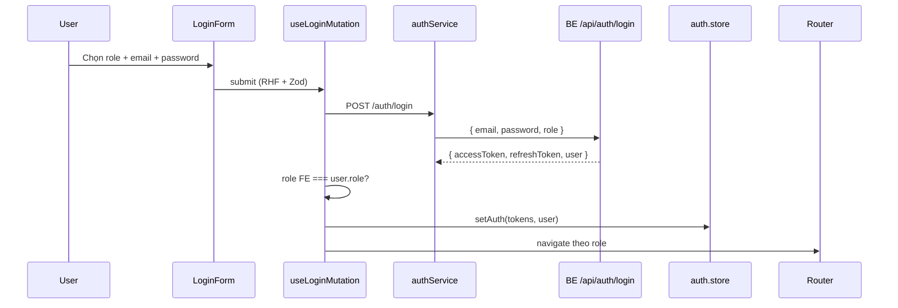
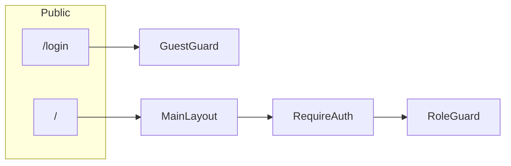

# FE Auth Base — Handoff cho team (Quang)

> Branch: `feature/se-f1-auth-login`  
> Requirement: **SE-F1** (Authentication & Authorization)  
> **PR target: `dev`** — không merge thẳng `main`.

---

## 1. Mục tiêu đã làm

Nền tảng Frontend cho đăng nhập và phân quyền:

| AE | Role | Route | Folder |
|----|------|-------|--------|
| **Vũ** | Student | `/student` | `src/features/student/` |
| **Long** | Teacher | `/teacher/dashboard` | `src/features/dashboard/` |
| **Quốc Anh** | Admin | `/admin/dashboard` | `src/features/dashboard/` |

- Không có **Register** public (admin provision)
- Login full-page tại `/login` (tách khỏi MainLayout)
- UI: shadcn/ui + theme aviation, role picker 3 role
- Logo ✈️ trên login click → về Home

---

## 2. Luồng đăng nhập



| Role | Redirect |
|------|----------|
| STUDENT | `/student` |
| TEACHER | `/teacher/dashboard` |
| ADMIN | `/admin/dashboard` |

---

## 3. Route & Guards



| Guard | Path | Hành vi |
|-------|------|---------|
| `GuestGuard` | `shared/components/common/GuestGuard.tsx` | Đã login → redirect home theo role |
| `RequireAuth` | `shared/components/common/RequireAuth.tsx` | Chưa login → `/login` + lưu `from` |
| `RoleGuard` | `shared/components/common/RoleGuard.tsx` | Sai role → redirect home role |

---

## 4. Cấu trúc thư mục

Theo [main-course-project](https://github.com/kat-minh/main-course-project):

```
src/
  app/                 # App.tsx, router.tsx, providers/
  features/
    auth/              # types, schema, store, services, hooks, components, pages
    landing/           # HomePage
    student/
    dashboard/
  shared/
    components/ui/     # shadcn primitives
    components/common/ # guards, RouteErrorBoundary, StatusStates
    layouts/           # MainLayout
    constants/         # API_ENDPOINTS
    types/
  lib/                 # axios.ts, queryClient.ts, utils.ts
  styles/              # globals.css
```

### Auth feature (`features/auth/`)

| File | Mô tả |
|------|--------|
| `types.ts` | `UserRole`, `LoginRequest`, `ROLE_HOME_PATH` |
| `schema.ts` | Zod `loginSchema` |
| `store.ts` | Zustand persist `ojt-kns-auth` |
| `services.ts` | `authService.login/logout` |
| `hooks/useAuth.ts` | `useLoginMutation`, `useLogoutMutation` |
| `components/LoginForm.tsx` | Form + role picker |
| `pages/LoginPage.tsx` | Wrapper |

---

## 5. Stack

| Công nghệ | Dùng cho |
|-----------|----------|
| React 18 + TS + Vite | Scaffold |
| React Router v6 | Routing, lazy load |
| Zustand + persist | Auth state |
| TanStack Query | Login/logout mutations |
| Axios (`lib/axios.ts`) | HTTP + interceptors |
| RHF + Zod | Login validation |
| shadcn/ui + Tailwind | UI |
| Sonner | Toast |
| Lucide | Icons |

---

## 6. API contract (Chinh — BE)

### `POST /api/auth/login`

```json
{
  "email": "student@academy.edu",
  "password": "string",
  "role": "STUDENT"
}
```

Response: `accessToken`, `refreshToken`, `user: { id, fullName, email, role }`

`role`: `STUDENT` | `TEACHER` | `ADMIN`

Normalize tại `features/auth/services.ts` (hỗ trợ `result`, snake_case).

### `POST /api/auth/logout` — optional

### `POST /api/auth/refresh` — optional

---

## 7. Chạy local

```bash
cd FE
npm install
npm run dev
```

- FE: http://localhost:5173
- Proxy `/api` → localhost:3000

```bash
npm run build
npm run lint
```

---

## 8. Thêm feature mới

1. `src/features/<module>/pages/YourPage.tsx`
2. `src/features/<module>/services.ts`
3. `src/features/<module>/hooks/useXxx.ts` (nếu cần)
4. `src/features/<module>/index.ts`
5. `src/app/router.tsx` + `RoleGuard`
6. `src/shared/layouts/MainLayout.tsx` (nav nếu cần)

**Không** duplicate server data vào Zustand — dùng React Query cho API data.

---

## 9. Trạng thái

- [x] Auth scaffold + guards + router
- [x] shadcn/ui login + home
- [x] Role picker (3 roles)
- [x] Folder structure main-course-project
- [ ] Login end-to-end — chờ BE Chinh
- [ ] Student / Teacher / Admin features — ae owner

---

## 10. Git

```bash
# Branch hiện tại
feature/se-f1-auth-login

# Commits gần nhất
# [SE-F1.1] feat: implement login form and auth guards
# [SE-F1.1] refactor: align FE structure with main-course-project pattern
# [SE-F1.1] fix: use plane logo as back-to-home link on login

# Sau merge dev
git checkout dev && git pull origin dev
```

**Commit format:** `[SE-Fx.x] feat|fix|refactor: mô tả`

---

*Liên hệ: **Quang** (FE Auth) — **Chinh** (BE Auth API)*
