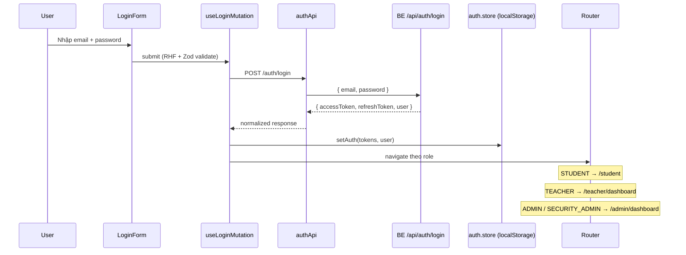
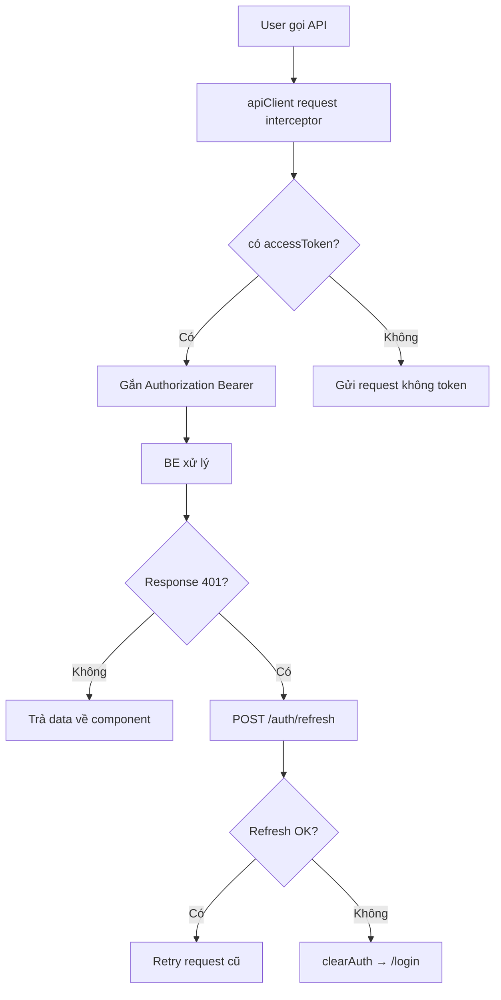
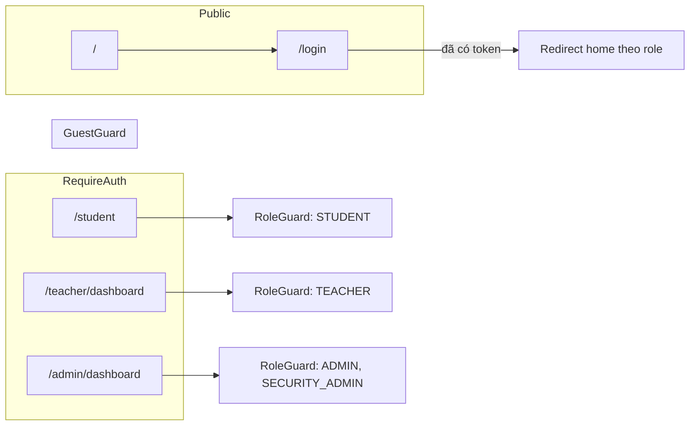

# FE Auth Base — Handoff cho team (Quang)

> Branch: `feature/se-f1-auth-login`  
> Requirement: **SE-F1** (Authentication & Authorization)  
> **Không merge vào `main`** — chờ review và merge vào `dev`.

---

## 1. Mục tiêu đã làm

Xây dựng **nền tảng Frontend** cho module đăng nhập và phân quyền, để các ae bắt đầu code feature theo actor:

| AE | Role | Route sẵn có | Folder gợi ý |
|----|------|--------------|--------------|
| **Vũ** | Student FE | `/student` | `src/features/student/` |
| **Long** | Teacher FE | `/teacher/dashboard` | `src/features/dashboard/` |
| **Quốc Anh** | Admin FE | `/admin/dashboard` | `src/features/dashboard/` |

**Lưu ý:** Không có trang **Register public** — đúng master concept (tài khoản do Admin cấp).

---

## 2. Luồng đăng nhập (Auth Flow)



### Sau khi đã login



### Logout

1. User bấm **Logout** trên `MainLayout`
2. `useLogoutMutation` → `POST /api/auth/logout` (lỗi vẫn logout client)
3. `clearAuth()` — xóa Zustand + localStorage
4. `queryClient.removeQueries()` — xóa cache React Query
5. Redirect `/login`

---

## 3. Luồng Route & Guards



| Guard | File | Hành vi |
|-------|------|---------|
| `GuestGuard` | `components/guards/GuestGuard.tsx` | Đã login → không vào `/login` |
| `RequireAuth` | `components/guards/RequireAuth.tsx` | Chưa login → `/login` + lưu `from` |
| `RoleGuard` | `components/guards/RoleGuard.tsx` | Sai role → redirect về home role |

---

## 4. Cấu trúc thư mục FE

```
FE/src/
├── components/
│   ├── guards/       RequireAuth, GuestGuard, RoleGuard
│   ├── layouts/      MainLayout (header, nav, logout)
│   ├── ui/           Button, Input, Card, StatusStates, Skeleton
│   └── errors/       RouteErrorBoundary
├── features/
│   ├── auth/         LoginForm, LoginPage        ← Quang
│   ├── student/      StudentHomePage (placeholder) ← Vũ
│   └── dashboard/    Teacher + Admin (placeholder) ← Long, Anh
├── hooks/            useLoginMutation, useLogoutMutation
├── lib/
│   ├── api/          auth.api.ts (normalize BE response)
│   └── http/         apiClient.ts (axios + interceptors)
├── stores/           auth.store.ts (Zustand + persist)
├── types/            auth.ts, axios.d.ts
├── utils/            rules.ts (Zod loginSchema)
├── pages/            HomePage.tsx
├── router.tsx
└── main.tsx          QueryClient + Router + Toaster
```

---

## 5. Stack đã setup

| Công nghệ | Dùng cho |
|-----------|----------|
| React 18 + TypeScript + Vite | Scaffold |
| React Router v6 | Routing, lazy load |
| Zustand + persist | Auth state (token, user) |
| TanStack React Query | Login/logout mutations |
| Axios | HTTP + interceptors |
| React Hook Form + Zod | LoginForm validation |
| Tailwind CSS | UI + theme tokens |
| Sonner | Toast notifications |
| Lucide React | Icons (không dùng emoji) |

---

## 6. API cần BE (Chinh) — contract FE đang expect

### `POST /api/auth/login`

**Request:**
```json
{
  "email": "student@academy.edu",
  "password": "string"
}
```

**Response (camelCase):**
```json
{
  "accessToken": "jwt...",
  "refreshToken": "jwt...",
  "user": {
    "id": "1",
    "fullName": "Nguyen Van A",
    "email": "student@academy.edu",
    "role": "STUDENT"
  }
}
```

`role`: `STUDENT` | `TEACHER` | `ADMIN` | `SECURITY_ADMIN`

FE normalize thêm shape `result` / `snake_case` trong `auth.api.ts` nếu BE trả khác format.

### `POST /api/auth/logout` — optional

### `POST /api/auth/refresh` — optional (cho auto-refresh 401)

Chi tiết: xem `FE/README.md`

---

## 7. Cách chạy local

```bash
cd FE
cp .env.example .env
npm install
npm run dev
```

- FE: http://localhost:5173  
- Proxy `/api` → http://localhost:3000 (khi BE chạy)

```bash
npm run build   # production build
npm run lint    # ESLint
```

---

## 8. Hướng dẫn ae thêm feature mới

1. Tạo page: `src/features/<module>/pages/YourPage.tsx`
2. Tạo API service: `src/lib/api/<module>.api.ts` — **normalize response BE tại đây**
3. Custom hook React Query (nếu cần): `src/hooks/useXxx.ts`
4. Thêm route trong `router.tsx` + bọc `RoleGuard` đúng role
5. Thêm nav link trong `MainLayout.tsx` (nếu cần)

**Không** duplicate server data vào Zustand — dùng React Query cho data từ API.

---

## 9. Việc chưa làm (ngoài scope Quang)

- [ ] UI pixel-perfect theo Google Stitch (cần design export)
- [ ] shadcn/ui full init (`npx shadcn init`) — hiện dùng UI components tự viết theo tokens
- [ ] Tích hợp login thật — chờ BE Chinh
- [ ] Feature Student / Teacher / Admin — ae owner từng phần

---

## 10. Git

```bash
# Đang ở branch
feature/se-f1-auth-login

# Sau khi merge vào dev, ae pull:
git checkout dev
git pull origin dev
```

**Commit message mẫu:** `[SE-F1.1] feat: implement login form and auth guards`

---

*Liên hệ: **Quang** (FE Auth) — **Chinh** (BE Auth API)*
